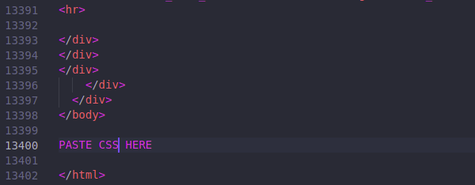

## The Book of PsiMulations

---

The one-stop destination for anything computational physics, starting from basic concepts to detailed implementations of mini-projects. The website consists of interlinked HTML pages and includes code written in Python and Julia at the moment.

---

## Website structure

Each of the HTML pages have been generated via one of three ways, forming a distinct structure in the way we create these notebooks;

- **Explanation pages:** These are pure markdown pages converted to HTML via [**Typora**](https://typora.io/), using a custom CSS design. This has been done to make it easy for new contributors to type up the explanations, independent from the implementation. This would carry the physics/mathematical theory relevant to the simulation, with graphs and images to aid explanation.
- **Python Implementation:** These are HTML exports of Jupyter notebooks. This would carry detailed code and comments guiding the reader through the process of simulating the system. 
- **Julia Implementation:** These are HTML exports of Pluto notebooks (Jupyter can also be used, but Pluto is preferable due to ease of sharing the source code, and a general love towards reactivity). 

---

## Applying the design

We have thrown together a messy albeit working set of CSS code for each of the three applications above to make the website look like as coherent as possible, while allowing contributors to utilise notebooks without bothering much about it. These are the steps to apply the CSS to the generated HTML (Do it after the content has been written.)

- **Typora:** Upon opening, there is a Themes section under the toolbar. We will work with the **night** theme, and make changes to the fonts on top of it. You can also create a new theme if you prefer. 

  - Now, go to *File -> Preferences -> Appearances -> Open Theme Folder*.
  - This should open up a directory with various CSS files. Open the [**night.css**](css-files/night.css) file in a text editor and replace the contents with our version in the repository and save. 
  - Reload typora/reselect the theme to **night**, and you should be good to go. Exporting to HTML is as simple as doing *File -> Export -> HTML*. 

  Some useful markdown formatting in typora:

  - **bold**:  ``**text**``
  - *italic*:  ``*italic*``
  - line-break:   `` <blank line> --- <blank line>``
  - Latex: Need to enable first. Go to  File -> Preferences -> Markdown -> Syntax Support and choose the relevant options.
    -  inline-math:   ``$\LaTeX$``
    - math-block:   ``$$ <newline> \LaTeX <newline> $$``
  - button:   ``<a href="link_to_file" class="buttonCustom"> text_inside_button </a>``

- **Jupyter notebook:** Unfortunately both the CSS and its application are messy in this case. We will have to use this until a better alternative is found.

  - For testing the design inside the notebook while working on it; add ``from IPython.display import HTML``, and in a new cell, wrap the contents of [**DarkJupyter.css**](css-files/DarkJupyter.css) like so ``HTML(""" css_contents_go_here""")``. This will apply the theme but we could not find a way to hide the contents of a single cell in Jupyter, so we use a workaround.

  - Remove the cell with the CSS from the previous step and restart the kernel. Now simply export the HTML as usual (*File -> Download as -> HTML*). Open the HTML file in a text editor, scroll to the end of the file which looks something like this:

     

  - Insert the contents of [**DarkJupyter.css**](css-files/DarkJupyter.css) just before the last ``</body>`` tag as shown. Save the file and the theme should be applied.  

    

- **Pluto notebook:** Simply copy the contents of [**DarkPluto.css**]((css-files/DarkPluto.css)) and paste into an empty cell at the top of the notebook by wrapping it like so: ``html"""css_contents_go_here"""``.  Next, install the DarkMode package from [here](https://github.com/Pocket-titan/DarkMode) or simply by doing (``Pkg.add(PackageSpec(url="https://github.com/Pocket-titan/DarkMode"))``) and run these lines in a cell.

    ``begin 
    	import DarkMode
    	DarkMode.enable(theme="oceanic-next")
  end``

   Refresh the page and the theme should be applied.

---

## Contributing

(insert stuff about creating PR and branching)
